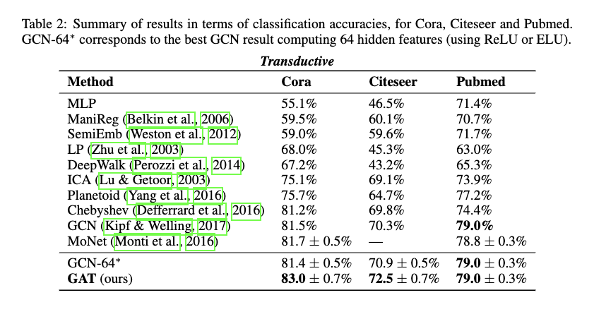
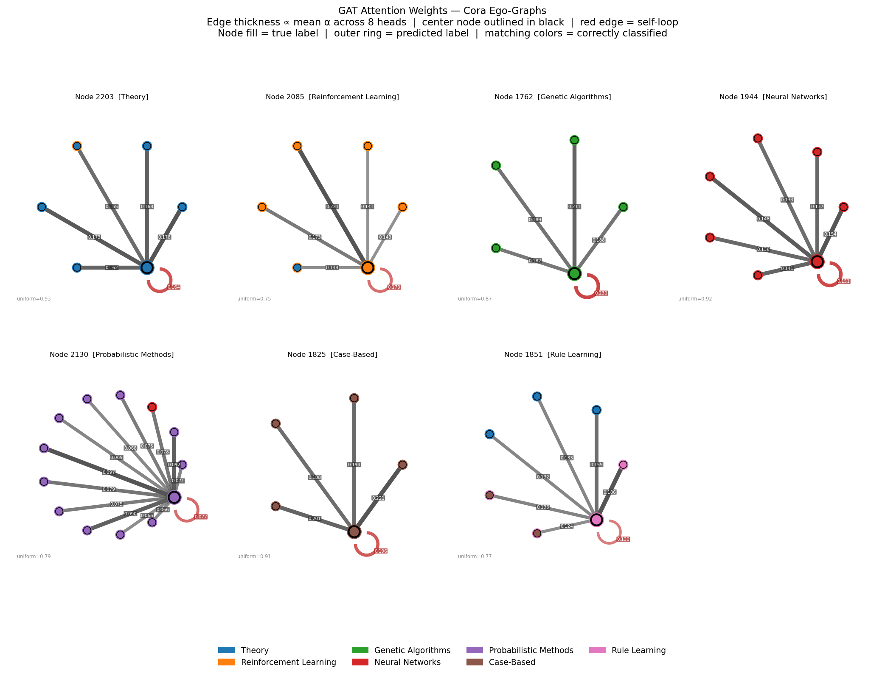
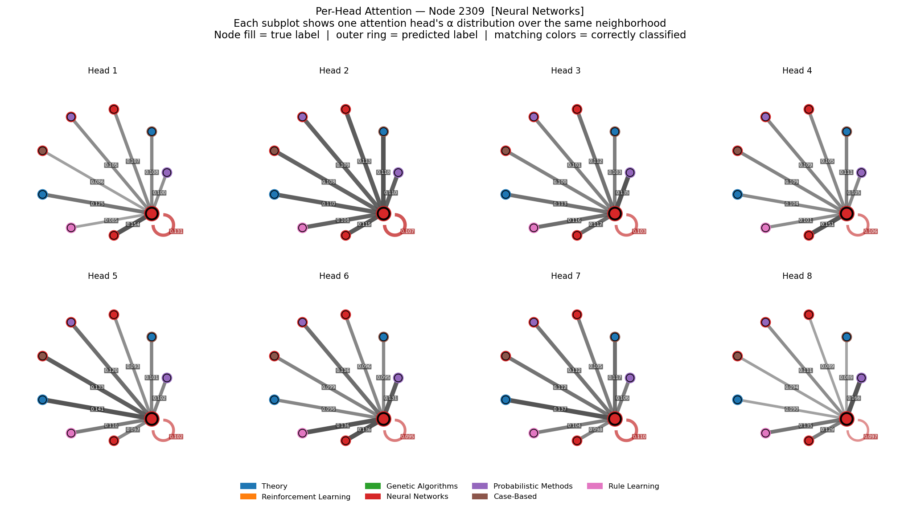
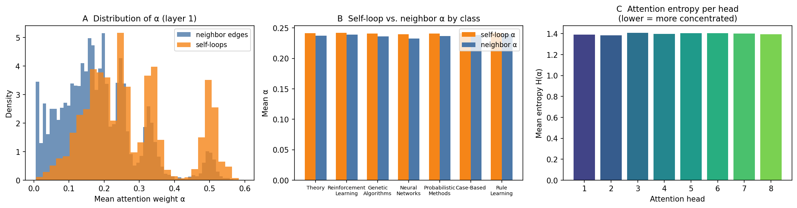
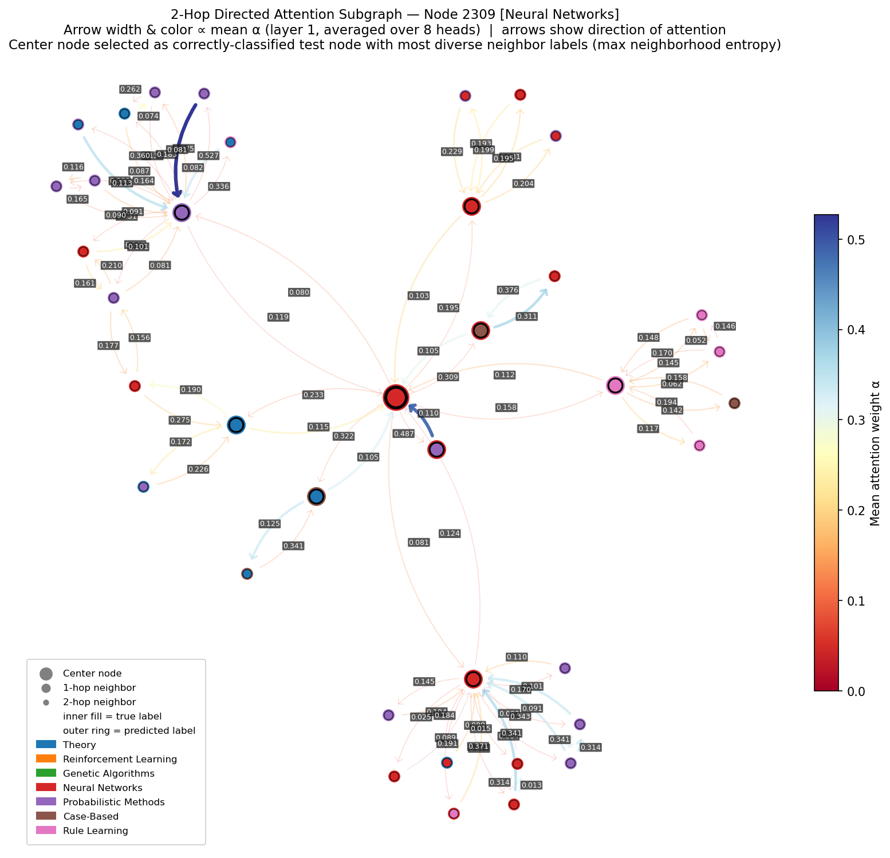

# cs4782_graph_attention_network


## Introduction

This repository contains a from-scratch PyTorch re-implementation of **Graph Attention Networks** (Veličković et al., ICLR 2018) as a final project for CS 4782: Intro to Deep Learning at Cornell University.

GAT's core contribution is applying a learned attention mechanism to graph neural networks. Rather than aggregating neighbor features with fixed weights (as in GCN), each node learns to weight its neighbors dynamically, making the model expressive and inductive.

## Chosen Result

We targeted **Table 2** from the original paper: transductive node classification on Cora and Citeseer. The reported results (Cora: 83.0 ± 0.7%, Citeseer: 72.5 ± 0.7%) are the central empirical claim that learned attention outperforms fixed-weight aggregation (GCN: 81.5% / 70.3%).



## GitHub Contents

| Directory | Contents |
|-----------|----------|
| `code/` | Re-implementation core (`gat_layer.py`, `model.py`, `train.py`, `data_utils.py`) and interactive demo (`demo_app.py`) |
| `data/` | Dataset info; Cora and Citeseer are auto-downloaded via PyTorch Geometric |
| `results/` | Training figures, attention visualizations, and best model checkpoint (`cora_best.pt`) |
| `poster/` | PDF of the in-class poster presentation |
| `report/` | PDF of the 2-page project summary report |

## Re-implementation Details

The GAT layer is implemented from scratch in raw PyTorch following Equations 1–6 from the paper (no `GATConv` or any library GAT layer). The 2-layer architecture uses 8 attention heads × 8 dimensions with ELU activation in layer 1, and a single head projecting to 7 classes with softmax in layer 2. Training uses the standard Cora and Citeseer splits with patience-100 early stopping, evaluated on node classification accuracy.

**Modification:** The paper underspecifies its early stopping criterion. We reset patience and save the model checkpoint whenever either validation loss decreases or validation accuracy improves, rather than tracking a single metric.

**Known gap:** PyTorch vs. TensorFlow weight initialization differences likely account for the small accuracy gap relative to the reported results.

## Reproduction Steps

**Install dependencies:**
```bash
pip install -r requirements.txt
```

**Train the model** (optional — a pre-trained checkpoint is already provided at `results/cora_best.pt`):
```bash
python code/train.py --dataset Cora --checkpoint results/cora_best.pt
# For Citeseer:
python code/train.py --dataset Citeseer
```

**Run the interactive demo:**
```bash
streamlit run code/demo_app.py
```
The demo loads the checkpoint from `results/cora_best.pt` automatically. If you retrained, ensure the checkpoint was saved to that path.

No GPU required. Cora trains in under 5 minutes on CPU.

## Results/Insights

Our re-implementation closely reproduces the paper's results, with a small accuracy gap attributable to framework differences.

| Method | Cora | Citeseer |
|--------|------|----------|
| GCN (Kipf & Welling, 2017) | 81.5% | 70.3% |
| GAT — paper (Veličković et al., 2018) | 83.0 ± 0.7% | 72.5 ± 0.7% |
| GAT — ours | 80.9 ± 1.0% | 69.0 ± 1.2% |


**Attention visualizations** (reproducing paper-style analysis):

Ego-graph attention weights for one node per Cora class — edge thickness encodes mean attention across 8 heads, red edge is the self-loop.



All 8 attention heads separately for a single node, showing how different heads specialize.



**Extended analysis** (beyond the paper):

Attention weight distribution (layer 1), self-loop vs. neighbor α by class, and entropy per head — lower entropy means a head attends more selectively.



2-hop directed attention subgraph — arrow width and color encode mean attention weight, revealing which neighbors the model relies on most.



## Conclusion

We successfully re-implemented GAT from scratch in PyTorch, reproducing the paper's core finding that learned attention outperforms fixed-weight aggregation on node classification. The small accuracy gap (Cora: 80.9% vs. 83.0%) highlights how underspecified training details like initialization and early stopping criteria can meaningfully affect results. Our extended attention analysis further confirms that self-loops receive higher weight and that heads attend broadly rather than selectively. The interactive demo makes these patterns explorable in real time, revealing how individual attention heads respond to different graph neighborhoods.

## References

- Veličković, P., Cucurull, G., Casanova, A., Romero, A., Liò, P., & Bengio, Y. (2018). *Graph Attention Networks*. ICLR 2018.
- Kipf, T. N., & Welling, M. (2017). *Semi-Supervised Classification with Graph Convolutional Networks*. ICLR 2017.
- Sen, P., et al. (2008). *Collective Classification in Network Data*. AI Magazine. (Cora & Citeseer datasets)
- Fey, M., & Lenssen, J. E. (2019). *Fast Graph Representation Learning with PyTorch Geometric*. ICLR Workshop 2019.
- Paszke, A., et al. (2019). *PyTorch: An Imperative Style, High-Performance Deep Learning Library*. NeurIPS 2019.

## Acknowledgements

This project was completed as part of CS 4782: Intro to Deep Learning at Cornell University (Spring 2026). We thank the course staff for guidance and feedback throughout the project.
